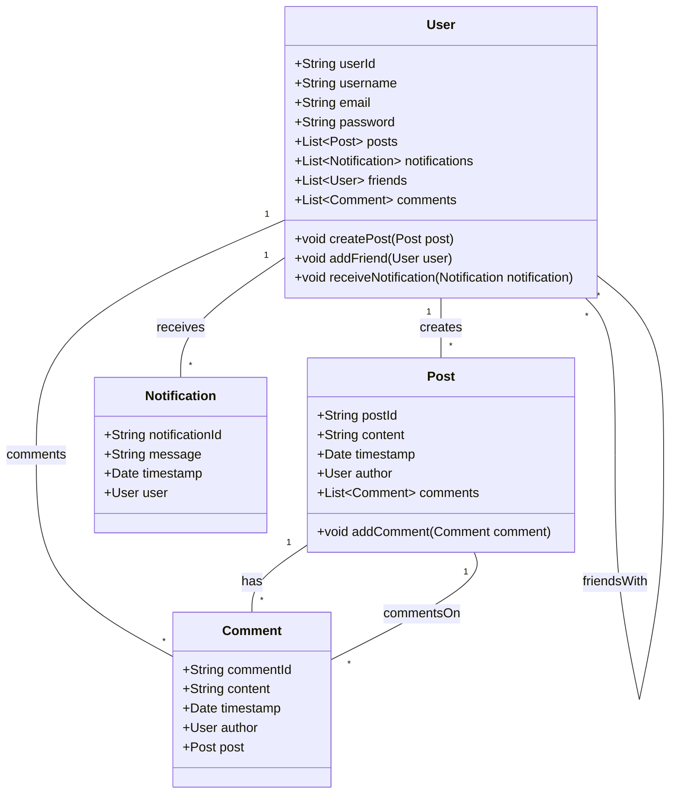

# Java Spring Boot Claro

Este projeto implementa um sistema de interação social básico usando **Java Spring Boot**. O sistema permite que os usuários criem postagens, comentem, façam amigos e recebam notificações. O projeto simula funcionalidades típicas de uma rede social, utilizando uma arquitetura orientada a objetos com classes para **Usuários**, **Postagens**, **Comentários** e **Notificações**.

## 🛠 Estrutura do Projeto

O projeto é composto por quatro classes principais, como representado no diagrama de classes:

### 1. **User** (Usuário)
- Representa um usuário da rede social.
- Atributos:
  - `userId`: ID único do usuário.
  - `username`: Nome de usuário.
  - `email`: Endereço de email do usuário.
  - `password`: Senha de acesso do usuário.
  - `posts`: Lista de postagens feitas pelo usuário.
  - `notifications`: Lista de notificações recebidas pelo usuário.
  - `friends`: Lista de amigos do usuário.
  - `comments`: Lista de comentários feitos pelo usuário.
- Métodos:
  - `createPost(Post post)`: Cria uma nova postagem.
  - `addFriend(User user)`: Adiciona um amigo à lista de amigos.
  - `receiveNotification(Notification notification)`: Recebe uma nova notificação.

### 2. **Post** (Postagem)
- Representa uma postagem criada por um usuário.
- Atributos:
  - `postId`: ID único da postagem.
  - `content`: Conteúdo da postagem.
  - `timestamp`: Data e hora em que a postagem foi criada.
  - `author`: Autor da postagem (referência a um objeto `User`).
  - `comments`: Lista de comentários na postagem.
- Métodos:
  - `addComment(Comment comment)`: Adiciona um comentário à postagem.

### 3. **Comment** (Comentário)
- Representa um comentário feito por um usuário em uma postagem.
- Atributos:
  - `commentId`: ID único do comentário.
  - `content`: Conteúdo do comentário.
  - `timestamp`: Data e hora em que o comentário foi feito.
  - `author`: Autor do comentário (referência a um objeto `User`).
  - `post`: A postagem à qual o comentário está associado.
  
### 4. **Notification** (Notificação)
- Representa uma notificação recebida por um usuário.
- Atributos:
  - `notificationId`: ID único da notificação.
  - `message`: Mensagem da notificação.
  - `timestamp`: Data e hora da notificação.
  - `user`: Usuário que recebe a notificação.

## ⚙️ Relacionamentos

- **User**:
  - Um usuário pode **criar várias postagens**.
  - Um usuário pode **comentar em várias postagens**.
  - Um usuário pode **receber várias notificações**.
  - Um usuário pode ter **vários amigos** (outros usuários).
  
- **Post**:
  - Uma postagem pode ter **vários comentários**.
  
- **Comment**:
  - Um comentário é sempre associado a **uma única postagem**.

## 🚀 Como Executar

Para rodar o projeto localmente, siga os passos abaixo:

### 1. Pré-requisitos

- **Java 17** ou superior.
- **Spring Boot** instalado.
- **Gradle** (ou Maven) para gerenciamento de dependências.

### 2. Clonar o Repositório

Clone o repositório do projeto para sua máquina local:

```bash
git clone https://github.com/SeuUsuario/JavaSpringBootClaro.git
```

### 3. Executar a Aplicação

Navegue até a pasta do projeto e execute a aplicação:

```bash
./gradlew bootRun
```

Ou, caso esteja usando Maven:

```bash
mvn spring-boot:run
```

A aplicação estará disponível em: `http://localhost:8080`.

## 🧪 Funcionalidades

- Criar postagens e comentários.
- Adicionar amigos.
- Receber notificações.
- Gerenciar listas de amigos, postagens e comentários.

## 📝 Melhorias Futuras

- Implementação de autenticação e autorização.
- Persistência de dados em um banco de dados relacional.
- Interface gráfica para interação com os usuários.

## 👨‍💻 Autores

- **Silas Henrique de Matos Cerqueira**
- **Claro** - Projeto desenvolvido como parte de um desafio de API REST para a empresa.



