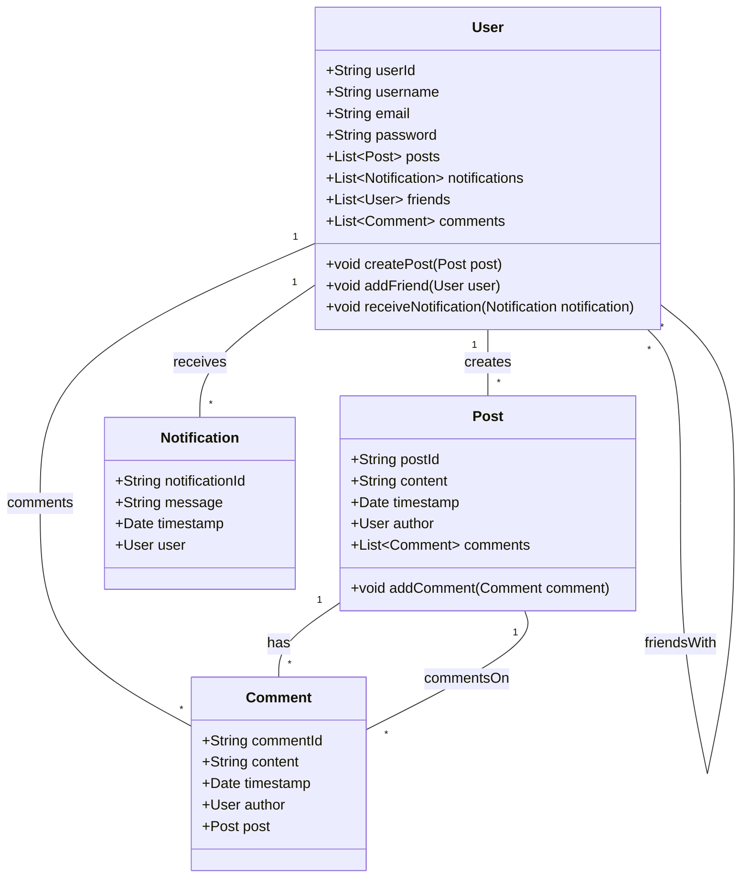

# Java Spring Boot Claro

```mermaid
classDiagram
    class User {
        +String userId
        +String username
        +String email
        +String password
        +List~Post~ posts
        +List~Notification~ notifications
        +List~User~ friends
        +List~Comment~ comments
        +void createPost(Post post)
        +void addFriend(User user)
        +void receiveNotification(Notification notification)
    }

    class Post {
        +String postId
        +String content
        +Date timestamp
        +User author
        +List~Comment~ comments
        +void addComment(Comment comment)
    }

    class Comment {
        +String commentId
        +String content
        +Date timestamp
        +User author
        +Post post
    }

    class Notification {
        +String notificationId
        +String message
        +Date timestamp
        +User user
    }

    User "1" -- "*" Post : creates
    User "1" -- "*" Comment : comments
    User "1" -- "*" Notification : receives
    User "*" -- "*" User : friendsWith
    Post "1" -- "*" Comment : has
    Comment "*" -- "1" Post : commentsOn
```
